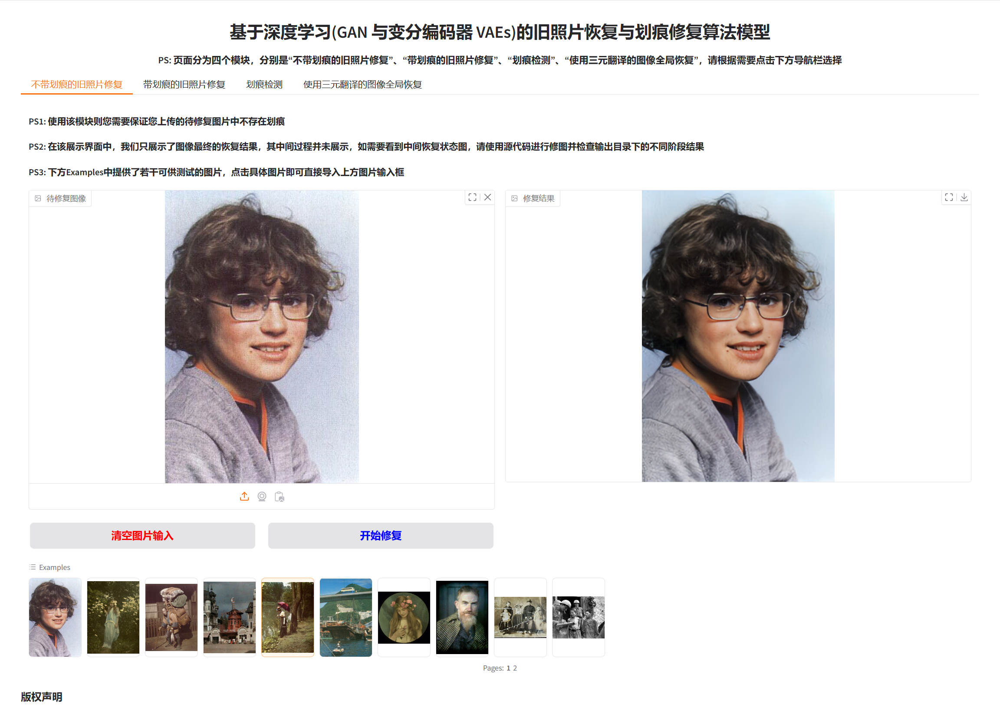
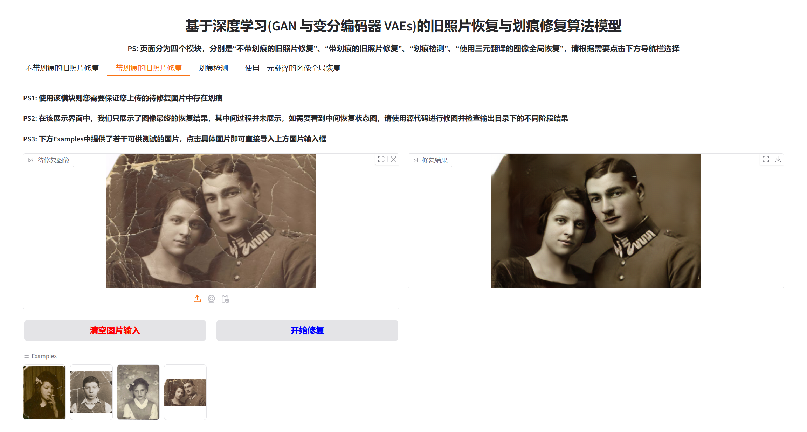

# 计算机毕业设计-基于深度学习的旧照片修复
#### 本篇文章是针对老（旧）照片色彩复原、上色，如果您想对灰白老照片进行上色，色彩复原，请参考这篇CSDN作品👇

[基于深度学习的老（旧）照片上色算法模型设计与实现（对抗生成式网络GAN、含Github代码与Web端设计）](https://blog.csdn.net/qq_45566099/article/details/138611013)

#### 本篇文章是针对老（旧）照片色彩复原、上色，如果你想对有大面积破损的图像进行修复，请参考这篇CSDN作品👇

[计算机毕业设计--基于深度学习技术（Transformer、GAN）的图像修复算法（含Github代码+GUI与Web端展示界面）](https://blog.csdn.net/qq_45566099/article/details/134942373)

更多基于深度学习的毕业设计请关注专栏 --- [计算机毕业设计](http://t.csdnimg.cn/ZTAtt)

:sparkles: Demo_1


:sparkles: Demo_2


## :sparkles: 图像修复在线体验

👇

 **Web端在线体验地址：**:white_check_mark:[访问这里进行老照片修复在线体验](http://zxxserver.e3.luyouxia.net:10853):white_check_mark:


**在线体验使用方式：**
&emsp;&emsp;打开连接后，左侧两个图片输入框分别需要上传待修复的原图和代表原图上破损位置的Mask。**在网页下方提供了四组输入样例，点击样例自动填充到相应位置后即可点击开始修复查看效果。**

**注意：** 修复第一张图的时候耗时较长，大约10秒左右。从第二张图开始，速度就会快起来，大约5秒左右一张（这主要是因为为了节约服务器资源，第一次启动的时候模型需要加载进显卡中）






## 运行要求
该代码需要在安装了Nvidia GPU和CUDA的计算机上运行，运行代码需要Python>=3.9。

<hr>
clone项目后，只需一个简单的命令即可轻松恢复旧照片。
对于没有划痕的图像：

```
python run.py --input_folder [test_image_folder_path] \
              --output_folder [output_path] \
              --GPU 0
```

对于带有划痕图像：

```
python run.py --input_folder [test_image_folder_path] \
              --output_folder [output_path] \
              --GPU 0 \
              --with_scratch
```
**对于带有划痕的高分辨率（就是说图像清晰度很高）图像**：

```
python run.py --input_folder [test_image_folder_path] \
              --output_folder [output_path] \
              --GPU 0 \
              --with_scratch \
              --HR
```

注意：请修改上述步骤中[ ]内的路径，模型修复完成后，可以在“output_path”中检查不同步骤产生的修图结果。

### 2) 2024新开发功能---照片划痕检测

**下图展示划痕检测结果与修复结果**

### 3) 照片全图结构恢复（对老照片结构翻新，相当于清晰化，结构化）

**修复效果展示：**


### 4) 面部增强

**修复效果展示：**


> *注*：
> 由于该模型是用256*256个图像预训练的，因此使用该模型需要将图像分辨率（像素）调整为256。
### 5) 一个用户友好的GUI界面
本科毕业学生选择做深度学习相关的毕业设计，不可能完全专注于算法，因此本项目配套设计了一个基于pyqt（python提供的一个图形化界面）的GUI界面，它接受用户待修复的照片图像输入，并在相应的窗口中显示结果。

#### 如何使用？
1.在pycharm中运行GUI.py文件。
2.单击浏览并选择待修复的图像以修复划痕（test_images/old_w_scratch文件夹中提供了可用于测试的图像）。
3.单击“修改照片”按钮。
4.等待一段时间（控制台会有算法的中间过程输出），然后在GUI窗口上查看修复结果。
5.单击“保存”，或者“退出窗口”退出，保存后的图片会在指定的文件夹中获取到。

## 如何自行训练模型?

- **咨询作者**

## 有问题联系作者：
- VX：Accddvva
- QQ：1144968929
- **该项目代码提供训练好的模型文件以及调用该文件进行修图的测试代码（clone后安装环境即可使用，开源版不包含模型源码以及gui）**
- 本项目完整代码+环境配置教程+代码使用方式+GUI界面 == **价格300RMB，可提供远程部署服务，另外提供GPU服务器短期租赁服务，24G显存服务器每个月100RMB**

<hr>

#### 广告
- 作者于浙江某985高校就读人工智能方向研究生(CSDN已认证)，可以定制模型，并提供相应技术文档以及各种需要，只需要描述需求即可
- 人工智能、深度学习领域，尤其是计算机视觉（Computer vision，CV）方向的模型or毕业设计，只要你想得出，没有做不出
