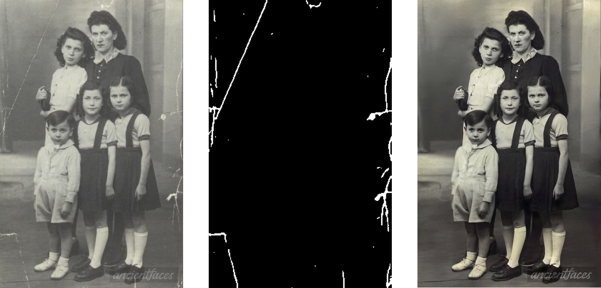
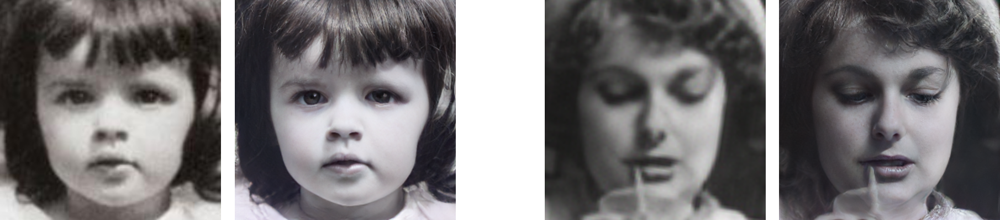
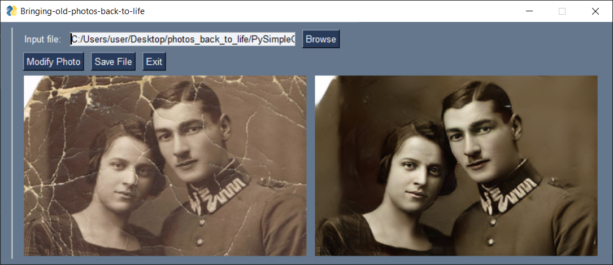

# 计算机毕业设计-基于深度学习的旧照片修复

####本篇文章是针对老照片的上色，清晰化，如果你想对破损照片修复，请参考我的另一篇github作品----https://github.com/zxx1218/image_fix


## :sparkles: News


## 运行要求
该代码需要在安装了Nvidia GPU和CUDA的计算机上运行，运行代码需要Python>=3.6。

## 作者联系方式

- VX：Accddvva
- QQ：1144968929
- CSDN：https://blog.csdn.net/qq_45566099?spm=1011.2415.3001.5343
- 作者于浙江大学计算机科学与技术学院攻读博士学位

## :rocket: 使用方式

clone项目后，只需一个简单的命令即可轻松恢复旧照片。
对于没有划痕的图像：

```
python run.py --input_folder [test_image_folder_path] \
              --output_folder [output_path] \
              --GPU 0
```

对于带有划痕图像：

```
python run.py --input_folder [test_image_folder_path] \
              --output_folder [output_path] \
              --GPU 0 \
              --with_scratch
```

**对于带有划痕的高分辨率（就是说图像清晰度很高）图像**：

```
python run.py --input_folder [test_image_folder_path] \
              --output_folder [output_path] \
              --GPU 0 \
              --with_scratch \
              --HR
```

注意：请修改上述步骤中[ ]内的路径，模型修复完成后，可以在“output_path”中检查不同步骤产生的修图结果。

### 2) 2024年新功能---照片划痕检测

**下图展示划痕检测结果与修复结果**



### 3) 照片全图结构恢复（对老照片结构翻新，相当于清晰化，结构化）

**下图展示修复结果**


### 4) 面部增强

**展示修复结果**



> *注*：
> 由于该模型是用256*256个图像预训练的，因此该模型可能不能理想地用于任意分辨率。

### 5) GUI界面设计

该项目我们配套设计了一个用户友好的基于python的GUI，它接受用户的图像输入，并在相应的窗口中显示结果。

#### 如何使用:

1.运行GUI.py文件。
2.单击浏览并从test_images/old_w_scratch文件夹中选择图像以删除划痕。
3.单击“修改照片”按钮。
4.等待一段时间，然后在GUI窗口上查看结果。
5.单击“退出窗口”退出窗口，并在输出文件夹中获取结果图像。

**PS：github资源gui界面不公开免费使用，联系作者购买**



## 如何自行训练模型?

- **咨询作者**

## 有问题联系作者：

- VX：Accddvva
- QQ：1144968929
- 本项目完整代码+环境配置教程+代码使用方式+GUI界面 == **价格300RMB**
- 该项目代码只提供针对训练好的模型的测试功能（即可以clone后使用，但无算法模型设计源码）
- **广告：**模型作者目前研究方向人工智能，可以帮忙设计模型，并提供给你源代码和训练后的模型文件和环境配置以及使用方法，只需要告诉我你的需求并提供给我图片数据集即可，我的收费不高，因为大多数同学的毕业项目要求对我来说都比较容易
- 人工智能领域，尤其是计算机视觉（Computer vision，CV）方向的毕业设计，只要你想得出，没有做不出的
